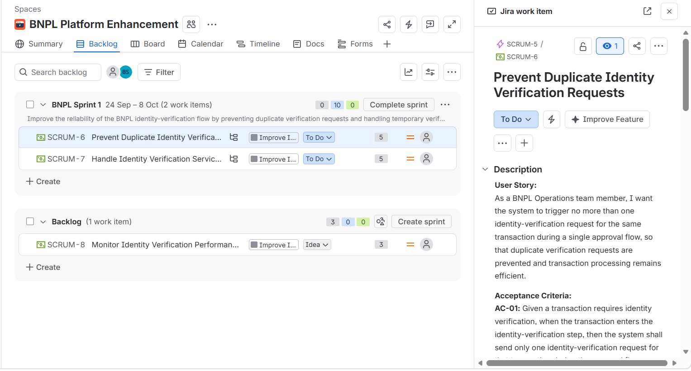

# BNPL Platform Performance Analysis

### End-to-End Business Analysis Case Study

Independent portfolio project analyzing transaction performance issues in a simulated BNPL platform using **Business Analysis, Data Analysis, Agile, and Power BI**.

> This project uses simulated data for portfolio purposes.
## 📄 Full Case Study

[View Full Business Analysis Case Study](Waad_Aljabr_BNPL_BA_Portfolio_Case_Study.pdf)
## 📄 Project Documentation

- [Full Business Analysis Case Study](اسم-ملف-البورتفوليو.pdf)
- [Business Requirements Document (BRD)](BNPL_BRD.pdf)
---

## 📊 Dashboard

### Key Findings

- Analyzed **6,000 transactions**
- Approval Rate declined from **76.4% → 66.9%**
- Mobile App Approval Rate declined from **74.7% → 60.2%**
- Technical-error declines increased by **122%**
- Mobile App technical errors increased by approximately **250%**
- Mobile App processing time increased from **3.81 → 6.99 sec**

---

## 🔍 Root Cause

The investigation identified an incomplete change impact assessment following the introduction of new real-time risk checks.

Some Mobile App flows could trigger identity verification through both the existing checkout flow and the new risk workflow, creating unintended duplicate verification requests.

---

## 💡 Proposed Solution

- Prevent unintended duplicate verification requests
- Retry verification once after timeout/unavailability
- Set the transaction to **Pending** if the retry fails
- Monitor verification performance and failures
- Strengthen Change Impact Assessment
- Perform E2E regression testing before deployment

---

## 🔄 Agile / Jira

Requirements were translated into Agile work items, acceptance criteria, story points, and Sprint planning in Jira.

---

## 📋 BA Deliverables

- Business Need, Problem Statement & Scope
- Stakeholder Analysis
- Data Quality & KPI Analysis
- Root Cause Analysis
- Requirements Register
- AS-IS / TO-BE & Gap Analysis
- BPMN
- BRD
- Agile User Stories & Acceptance Criteria
- RTM & UAT Plan
- SQL Analysis
- Power BI Dashboard
- Solution Evaluation

---

## 🎯 Success Criteria

| KPI | Target |
|---|---:|
| Approval Rate | ≥ 85% |
| Avg Processing Time | ≤ 5 sec |
| Duplicate Verification Requests | 0 |
| Verification Response Time | ≤ 2 sec for ≥95% |

---

## 🛠 Tools

**Excel • Power BI • DAX • SQL • Jira • Draw.io • BPMN**

---

## 👤 Author

**Waad Aljabr**  
Business Analysis | Performance Analytics | Process Improvement
